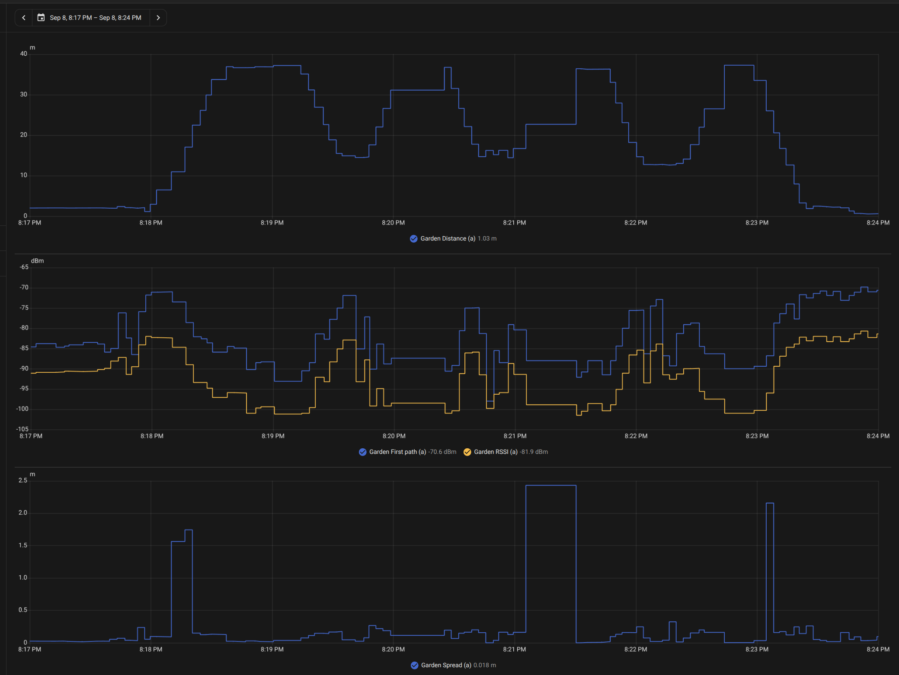
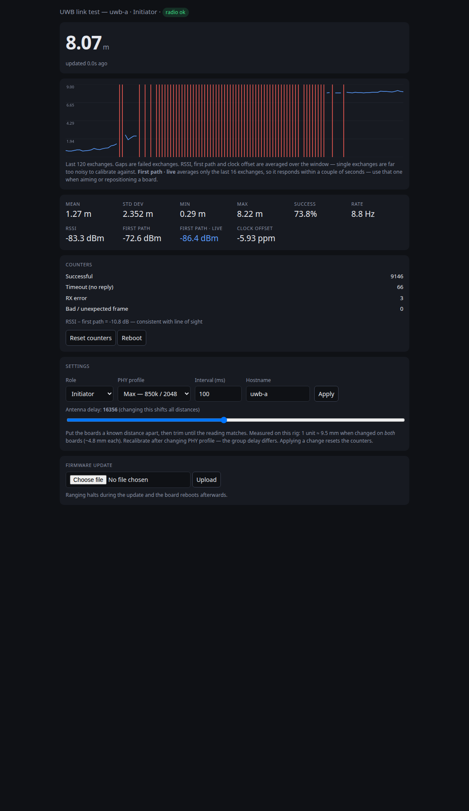

# BinRange

The calendar says it's bin night. Have the bins actually made it to the kerb?

BinRange gives each bin a battery-powered UWB tag. A fixed anchor measures its
distance and publishes per-tag telemetry to Home Assistant over MQTT. Moving
bins report frequently; stationary bins check in slowly. Home Assistant can
combine that physical evidence with collection dates to show what needs attention.

Collection scheduling for the Home Assistant automations leverages the brilliant
[Waste Collection Schedule](https://github.com/mampfes/hacs_waste_collection_schedule)
integration, available through [HACS](https://hacs.xyz/). It supplies the collection
calendar; BinRange supplies the bin's movement, distance and health.
The position-aware put-out/return reminder policy is still being completed.

## See it working



*Real development walk-test capture using two WROVER boards. Reliable readings
reached roughly 30 m in that setup, with intermittent readings beyond it.
This is not a guaranteed range for a packaged tag or a mounted bin.*

<details>
<summary>Test-phase web interface: live range, link diagnostics and radio tuning</summary>



*Historical SS-TWR test interface, not the current deployment UI. Its success
percentage and signal interpretation are test-rig diagnostics—not an end-to-end
delivery guarantee or a validated obstruction detector.*

</details>

The important distinction is between **a bin that is home** and **a bin whose
last known reading was home**. Stale data stays visible as stale; silence must
not be mistaken for a bin being put out or brought back.

## How it fits together

```text
Battery tags ──UWB──> Fixed anchor ──MQTT──> Home Assistant
    ▲                    │                     ▲
    └── signed BLE OTA ──┘                     │
                                 Waste Collection Schedule
```

- **Tags:** KKM K4W, nRF52833 + DW3110 + LIS3DH; custom Zephyr firmware.
- **Anchor:** Makerfabs ESP32-WROVER / DW3000; custom Arduino firmware with MQTT,
  local web administration and signed-tag-update delivery.
- **Home Assistant:** one device per tag plus anchor diagnostics; separate daily
  status and technical monitoring views.
- **Maintenance:** signed application updates, local health confirmation and
  rollback; SWD remains the first-installation/rescue path.
- **No ESPHome component or additional BinRange server.** Ranging does not depend
  on the MQTT broker or Home Assistant being available.

## Status and limitations

This is an **experimental, working field prototype**, not a turnkey product.
A six-tag installation has been commissioned; multi-week battery life, installed
coverage and unattended BLE maintenance are still under evaluation.

Default tag behavior is immediate motion reporting, about 5 s while moving,
settling after 30 s quiet, and a 10 min stationary check-in. Motion sensitivity
is tunable; missing-check-in monitoring is separate from short-term range
freshness. The initial absence threshold is six hours. Paired tags expose
stationary and moving check-in interval controls in Home Assistant; the anchor
applies them over authenticated Bluetooth and verifies the saved values.
See [check-in interval controls](docs/mqtt.md#changing-tag-check-in-intervals).

One anchor measures **distance, not direction or coordinates**. A Home/Out
distance threshold is site-specific; it cannot distinguish equal-radius places.
Metal, bodies, orientation and mounting affect coverage. Battery voltage is
measured; any percentage derived from it is an estimate, not a fuel gauge.
Do not infer months of battery life from a short voltage trace.

## Build your own

Start with [the setup guide](docs/getting-started.md), then the relevant firmware
instructions. You will need an appropriate UWB anchor, compatible tags, an SWD
programmer, a local MQTT broker and Home Assistant. Review the exact board pinout
and use your own credentials, tag identities and signing key.

| Reference | Purpose |
| --- | --- |
| [Getting started](docs/getting-started.md) | Prerequisites, setup sequence and local configuration |
| [Hardware](docs/hardware.md) | Components, wiring, battery and motion constraints |
| [MQTT / Home Assistant](docs/mqtt.md) | Topics, adoption, freshness and scheduling integration |
| [Signed tag build and recovery](firmware/k4w-tag/BUILD.md) | SDK, partitions, signing and safe installation |
| [BLE update contract](docs/tag-updates.md) | Authentication, persistence and recovery invariants |
| [Nesso SWD probe](firmware/nesso-probe/README.md) | Optional programmer build and wiring |
| [Findings](docs/findings.md) | Reusable measured results and their limitations |
| [Roadmap](docs/current-work.md) | Remaining project acceptance work |

## Repository hygiene

This repository contains reusable source, documentation, synthetic test
identities and selected screenshots. Local addresses, household calendars,
physical tag/casing registers, credentials, signing keys, private captures and
provisioned firmware belong in ignored local storage—not Git.

On an existing working installation, consult ignored
`local-backups/deployment/docs/current-work.md` for its private operating plan
before touching devices. Public examples are not deployment instructions for
someone else's hardware. Do not blindly replay first installation on a paired tag.

Vendor notices remain in their source files. No blanket project licence has
been selected yet; public availability alone does not grant redistribution
rights. See [third-party notes](docs/third-party.md).
